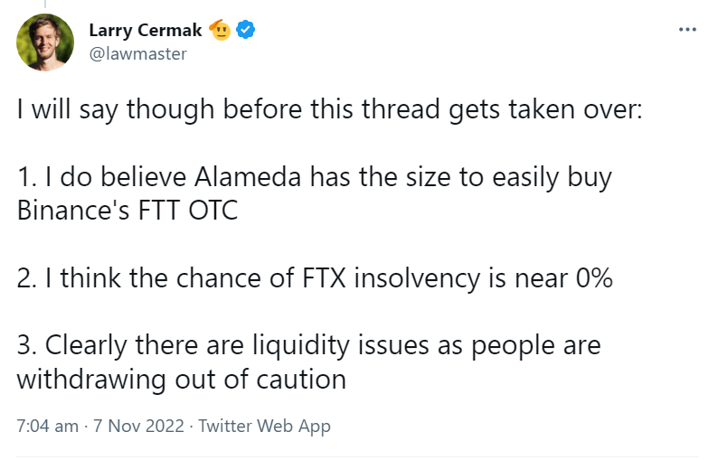

# Social Arsenal
Sometimes someone is being a clown on the internet. Somewhere on your hard drive is the perfect screenshot to prove to the world that the clown in question is a fool, a hypocrite, a criminal, or worse. But then - horrors - you can't find the screenshot in your vast archive of screenshots of clowns clowning themselves on the internet.

Social Arsenal solves this.

### What It Do

It sorts screenshots, PDFs, etc. based on their name and/or their textual contents into folders based on a list of rules. The contents of the tweet/reddit post/etc are appended to the filename and the `ImageDescription` EXIF tag is set to the OCR text. For example this screenshot of a tweet by a noteworthy cryptocurrency "reporter" on the eve of FTX's implosion:



Would be renamed from `Screen Shot 2023-02-17 at 7.11.37 PM.png` to

```
Tweet by @lawmaster: "I will say though before this thread gets taken over: 1. I do believe Alameda has the size to easily buy Binance\'s FIT OTC 2. I think the chance of FTX insolvency is near" Screen Shot 2023-02-17 at 7.11.37 PM.png
```

(Perhaps notable that the "reporter" in question for years maintained a private list of the blockchain addresses of Sam Bankman-Fried's various scams as part of his commitment to "unrivaled transparency".)

### Quick Start
```sh
pipx install screenshots_sorter

# Get help
sort_screenshots -h

# Dry run (don't actually move anything)
sort_screenshots

# Execute
sort_screenshots -e
```

# Setup
You may need to install:
* Python TK: `brew install python-tk@3.10`

Not required for standard PNG, JPG, etc. images but you may optionally install `exiftool` for other file types.
* ExifTool: `brew install exiftool` or download from https://exiftool.org


# Usage
The default is to sort cryptocurrency related content but you can define your own CSV of rules with two columns `folder` and `regex`. The value in `folder` specifies the subdirectory to sort into and `regex` is the pattern to match against. See [the default crypto related configuration](image_namer/sorting_rules/crypto.csv) for an example. An explanation of regular expressions is beyond the scope of this README but many resources are available to help. if you're not good at regexes just remember that any alphanumeric string is a regex that will match that string. [pythex](http://pythex.org/) is a great website for testing your regexes.
