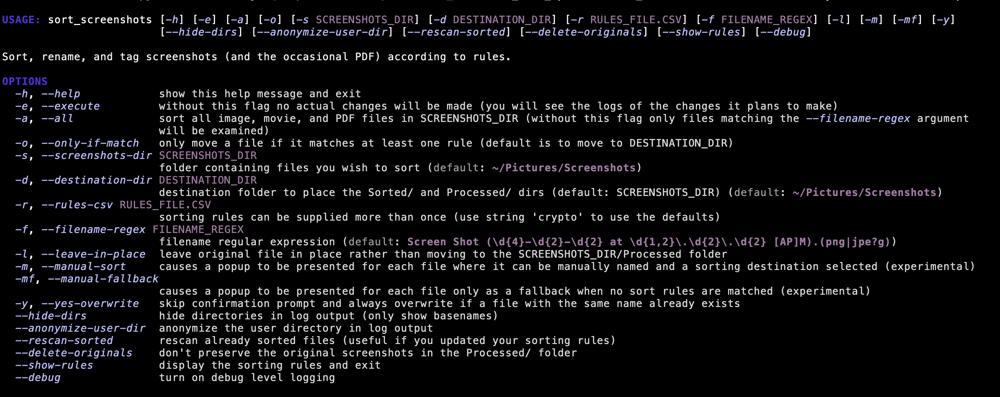

# CLOWN SORT
Sometimes someone is being a clown on the internet. Somewhere on your hard drive is the perfect screenshot to prove to the world that the clown in question is a fool, a hypocrite, a criminal, or worse. But then - horrors - you can't find the screenshot! It has been lost in your vast archive of screenshots of clowns clowning themselves on the internet.

Clown Sort[^1] solves this.


## What It Do
It sorts screenshots, PDFs, etc. based on their name and/or their textual contents into folders based on a list of rules. The contents of the tweet/reddit post/whatever are prepended to the filename and the `ImageDescription` EXIF tag is set to the OCR text. As you can configure your own arbitrary rules and run it against any set of images it works on many things other than screenshots of social media clowns, though the default configuration is for cryptocurrency clowns.

For example this screenshot of a tweet by a noteworthy cryptocurrency "reporter"[^2] on the eve of FTX's implosion:


Would be renamed from `Screen Shot 2023-02-17 at 7.11.37 PM.png` to

```
Tweet by @lawmaster: "I will say though before this thread gets taken over: 1. I do believe Alameda has the size to easily buy Binance\'s FIT OTC 2. I think the chance of FTX insolvency is near" Screen Shot 2023-02-17 at 7.11.37 PM.png
```

Other stuff that happens:
* The `ImageDescription` EXIF tag will be written (for images).
* All timestamps will be preserved.
* Files that match multiple patterns will be copied to multiple destination folders.
* The original file will be moved into a `Processed/` directory after it has been handled.

Note also that:
* This works on images that are more substantive than just self-clowning screenshots.
* So far only Tweets and Reddit screenshots have special handling beyond OCR text extraction.
* PDFs can be sorted by contents or filename, e.g. a PDF named `Norton Anthology of Crypto Bro Poetry.pdf` containing iambic verse like _["Fuck u justin sun  and fuck ur dick face... u all play with investing and money of the people !!!!"](https://universeodon.com/@cryptadamist/109642431382653023)_ by the noted bard JOKER_OF_CRYPTO will be copied to the `Justin Sun/` folder but not renamed.
* Videos are not OCRed and can only be moved based on filename matches, e.g. a file called `SBF is a big fat liar.mov` will be moved to the `FTX/` folder but otherwise left alone.

## Quick Start
```sh
# Installation with pipx is preferred if you have it but you can also use pip which comes standard
# on almost all systems. pipx is only a noticeably better answer if you're a python programmer who
# is concerned about side effects of pip upgrading system python packages.
pip install clown_sort

# Get help
sort_screenshots -h

# Dry run with default cryptocurrency sort rules (dry runs don't actually move anything,
# they just show you what will happen if you run again with the --execute flag)
sort_screenshots

# Execute default cryptocurrency sort rules against ~/Pictures/Screenshots
sort_screenshots --execute

# Sort a different directory of screenshots
sort_screenshots --screenshots-dir /Users/hrollins/Pictures/get_in_the_van/tourphotos --execute

# Sort with custom rules
sort_screenshots --rules-csv /Users/hrollins/my_war.csv --execute

# Sort pdfs
sort_screenshots -f '.*pdf$' -e
```

# Setup
[pipx](https://pypa.github.io/pipx/) is recommended because it keeps your system python environment safe but you can also just use `pip`.
```
pipx install clown_sort
```

Some (not many) PDFs require the `pycryptodome` package. To avoid complicating the dependency situation this is offered as an optional installation which can be accomplished with:

```sh
pipx install clown_sort[pycryptodome]
```


### Configuring With `.clown_sort` File
If there are command line options you find yourself specifying repeatedly you can place them in a `.clown_sort` file. When you invoke `sort_screenshots` the following locations will be checked for `.clown_sort`:

1. The current directory
2. Your home directory

See [the example](.clown_sort.example) for more information on what can be configured this way.

### Optional Components
If you want to use the popup window to manually tag you _may_ need to install:
* Python TK: `brew install python-tk@3.10` (if you don't have [homebrew](https://brew.sh/) you need to install it to run `brew install`)

Not required for standard PNG, JPG, etc. images but you may optionally install `exiftool` for other file types if you want excessive debugging.
* ExifTool: `brew install exiftool` or download from https://exiftool.org


# Usage
The default is for the tool to run in "dry run" mode, meaning it doesn't actually do anything - it just shows you what it _would_ do if you added the `--execute` flag. **YOU ARE ADVISED TO MAKE A BACKUP OF YOUR SCREENSHOTS FOLDER BEFORE HITTING THE `--execute` FLAG.**

While every effort has been made to use Python's cross platform `Pathlib` module as much as possible sometimes shit gets wonky on other platforms. This is 100x as true on Windows - Clown Sort has never been tested on a Windows platform.

### Help Screen


(In my personal usuage I tend to run the tool with the `--all` and `--only-if-match` options.)

### Custom Sorting Rules
The default is to sort cryptocurrency related content but you can define your own CSV of rules with two columns `folder` and `regex`. The value in `folder` specifies the subdirectory to sort into and `regex` is the pattern to match against. See [the default crypto related configuration](clown_sort/sorting_rules/crypto.csv) for an example. An explanation of regular expressions is beyond the scope of this README but many resources are available to help. If you're not good at regexes just remember that any alphanumeric string is a regex that will match that string. [pythex](http://pythex.org/) is a great website for testing your regexes.

### Example Output (Automated Sorting)


## Manually Sorting (Experimental)
**This is an experimental feature.** It's only been tested on macOS.

If you run with the `--manual-sort` command line the behavior is quite different. Rather than automatically sort files for you, instead for every file you will be greeted with a popup asking you for a desired filename and a radio button select of possible subdirectories off your `Sorted/` directory.

To use this feature you must install the optional `PySimpleGUI` package which can be accomplished like this:
```sh
pipx install clown_sort[PySimpleGUI]
```


# Contributing
Feel free to file issues or open pull requests.

This package is managed with [Python Poetry](http://python-poetry.org/). To get going:
1. Install Poetry.
1. `git clone` this repo.
1. `cd clown_sort`
1. `poetry install`
1. Optional components can be install with `poetry install -E pdf -E gui`

Only requirement is that tests should pass before you open it, which you can check with

```
pytest
```

[^1]: The name `clown_sort` was suggested by [ParrotCapital](http://twitter.com/ParrotCapital) and while the tool can work on any kind of screenshot it was too good not to use.

[^2]: Perhaps notable that the "reporter" in question for years maintained a private list of the blockchain addresses of Sam Bankman-Fried's various scams as part of his commitment to "unrivaled transparency".
